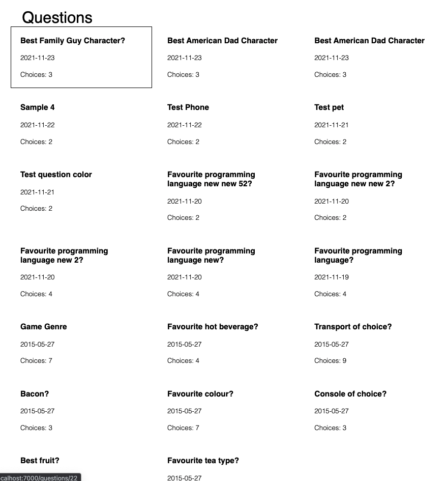

# Hey Car

[](https://app.netlify.com/sites/compassionate-aryabhata-8aa58d/deploys)


# Table of Contents

- [Getting Started](#getting-started)
- [Technology Stack](#technology-stack)
- [Installation](#installation)
- [Testing](#testing)
- [Questions](#questions)
- [Support or Contribution](#support-or-contribution)
- [Status](#status)

## Getting Started
This is a clientside javascript application built [React JS](https://reactjs.org/) application. The data exists on endpoints serve through the Poll [api](https://pollsapi.docs.apiary.io/)



## Technology Stack

**Client Side**
1. Github actions
2. React JS
3. Netlify


## Installation

1. Install [**Node JS**](https://nodejs.org/en/).

2. Clone the [**repository here**](https://github.com/benfluleck/photo-album-app.git)
3. [**cd**] into the root of the **project directory**.
4. Run `npm install` on the terminal to install project dependecies

5. Start the application:

**_Build Environments_**

### For Client
**Development**
```
npm run serve

Webpack should open your default browser automatically
```
- Navigate to `http://localhost:7000`

### CI/CD
The project uses a combination of Github Actions and Netlify. Each PR is tested and deployed on [here](https://compassionate-aryabhata-8aa58d.netlify.app/)

## Testing

Client side tests - Run `npm run test` on the terminal while within the **project root directory**.

Client side testing is achieved through the use of `jest` package. `jest` is used to test javascript code in
React applications.

Client side testing is yet to be configured but is being worked on currently

## Questions
For more details contact benny.ogidan@andela.com

## Support or Contribution
For any suggestions or contributions or issues please do raise them or email me.
For **Contributiions**, Please clone the repo and implement a PR I would appreciate it

## Status
Still undergoing testing
